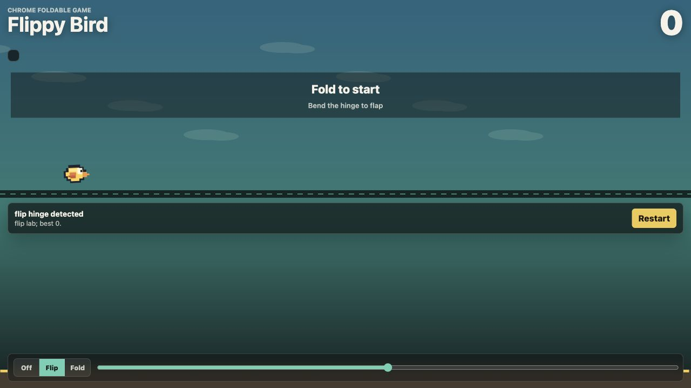

# Flippy Bird

A flip-phone exclusive version of the fold-controlled bird game for Chrome.



Open `index.html` in Chrome. On foldables, Chrome can expose:

- `navigator.devicePosture` for folded or continuous posture changes.
- `window.viewport.segments` for the two viewport regions created by a hinge in current Chrome.
- `window.visualViewport.segments` for older origin-trial builds.
- CSS media queries such as `vertical-viewport-segments: 2`.

For local testing on devices or DevTools emulation, enable Chrome's experimental web platform features if the APIs are not exposed:

```text
chrome://flags/#enable-experimental-web-platform-features
```

The game starts when Chrome exposes a real top-bottom segmented viewport, which is the Flip-style hinge path. If Chrome exposes `devicePosture: folded` but not segment geometry, the game falls back to a centered horizontal hinge on tall/narrow viewports so Samsung Flip and Motorola Razr-style devices still have a chance to run.

For desktop testing only, add lab mode:

```text
http://localhost:4173/?lab=1&emulate=flip
```

Lab mode exposes the desktop slider, tapping, and Space key so the game behavior can still be tested when foldable APIs are unavailable. The normal URL is locked on non-Flip devices.

## Assets

The bird sprites are original SVG pixel art for this project.

The pipe sprites are from Ian Peter's "Flappy Bird Style Sprites" on OpenGameArt.

- Source: https://opengameart.org/content/flappy-bird-style-sprites
- License: CC0

They are Flappy-like, but not the original Flappy Bird sprites.

## Real-device confidence check

Desktop emulation can verify the game logic, but only real Chrome foldable hardware can verify the browser-to-hardware bridge.

Use this URL on a real device:

```text
http://YOUR_LOCAL_IP:4173/?debug=1
```

Expected signals on a Flip-style device:

- `hasDevicePosture` is `true`, or posture updates when the device bends.
- `hasViewportObject` or `hasViewportSegments` is `true` when Chrome exposes the shipped API.
- `browserSegments` contains two entries in folded posture, or posture is `folded` on a tall/narrow viewport.
- The entries are stacked top-to-bottom for a Flip-style hinge.
- The game status says `flip hinge detected`.

The in-app `Flip` lab mode uses segment objects with the same shape as Chrome's viewport segment APIs, so once the debug readout confirms the real device provides stacked segments, the hardware path is exercising the same game code as the desktop lab path.
